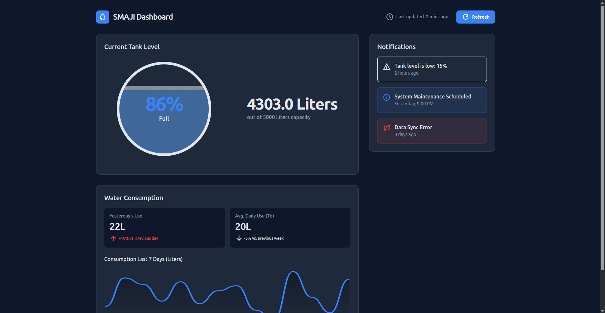

# SMAJI

Smaji is a household water intelligence system that helps household owners and property managers understand their consumption trends, access current water levels, and get low level alerts.
